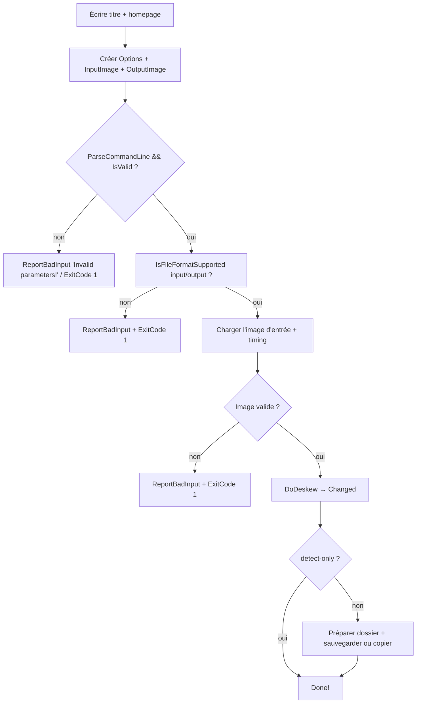

# 01 — Architecture et modules

## 1. Vue d'ensemble

Deskew est un outil en ligne de commande qui **redresse (deskew)** des documents
numérisés. Le principe :

1. charger une image,
2. la convertir en niveaux de gris 8 bits,
3. déterminer un seuil noir/blanc (Otsu ou valeur explicite),
4. détecter l'angle d'inclinaison des « lignes de texte » par **transformée de Hough**,
5. faire tourner l'image (avec filtre de rééchantillonnage) pour rendre ces lignes
   horizontales,
6. enregistrer le résultat.

Le programme s'appuie fortement sur la bibliothèque tierce **Vampyre Imaging** pour
l'entrée-sortie et la manipulation bas niveau des images. Dans la version Swift, cette
dépendance est remplacée par **ImageIO / Core Graphics** (+ éventuellement un petit
codec maison pour les formats non pris en charge).

## 2. Décomposition en couches

```text
┌─────────────────────────────────────────────────────────────┐
│ MainUnit.pas        Orchestration / sortie console          │
│  RunDeskew → DoDeskew                                       │
└───────────────┬─────────────────────────────┬───────────────┘
                │                             │
      ┌─────────▼──────────┐        ┌─────────▼──────────┐
      │ CmdLineOptions.pas │        │ Utils.pas          │
      │ Parsing CLI        │        │ Géométrie / unités │
      │ Zone de détection  │        └────────────────────┘
      └─────────┬──────────┘
                │
      ┌─────────▼──────────────────────────────┐
      │ ImageUtils.pas                         │
      │  Otsu / Binarize / RotateImage+filtres │
      └─────────┬──────────────────────────────┘
                │
      ┌─────────▼───────────────┐
      │ RotationDetector.pas    │
      │  CalcRotationAngle      │
      └─────────────────────────┘

      + Imaging/ (I/O, formats, métadonnées, helpers bas niveau)
```

### Frontière bibliothèque / code métier

| Domaine | Fourni par | À réimplémenter ? |
| ------- | ---------- | ----------------- |
| Lecture/écriture de fichiers image | `Imaging` (ImageIO côté Swift) | Non, remplacé par ImageIO |
| Enregistrement des formats (PNG, JPEG, TIFF, GIF…) | `Imaging` | Non, remplacé par ImageIO |
| Métadonnées de résolution (DPI) | `Imaging.TMetadata` | Non, remplacé par ImageIO (`kCGImagePropertyDPIWidth/Height`) |
| Accès pixel / layouts de couleur | `ImagingTypes`, `ImagingFormats` | **Oui** (nos propres types) |
| Rotation 90/180/270 | `Imaging.RotateImageMul90` | **Oui** (trivial) |
| Algorithmes métier | Unités projet | **Oui** (cœur du travail) |

## 3. Flux d'exécution (`RunDeskew`)



### `DoDeskew` en détail

```text
1. OutputImage = copie de InputImage (couleurs conservées)
   InputImage.Format := Gray8 (image de travail)
2. Si DpiOverride > 0 → GlobalMetadata.SetPhysicalPixelSize(ruDpi, dpi, dpi)
3. ContentRect = Options.CalcContentRectForImage(InputImage.BoundsRect, metadata)
   → échec = exception « image sans DPI »
4. Threshold :
   - explicite  → valeur utilisateur
   - Otsu       → OtsuThresholding(image grise, ContentRect)
5. SkewAngle = CalcRotationAngle(MaxAngle, AngleStep, Threshold, W, H, Bits, ContentRect, Stats)
6. Si SaveWorkImage → BinarizeImage(InputImage, Threshold, ContentRect) puis save work-image.png
7. Si detect-only → retour (sortie sans rotation)
8. Si |SkewAngle| >= SkipAngle :
   - EnsurePixelFormatForRotation (Gray8 / RGB24 / ARGB32)
   - RotateImage(OutputImage, SkewAngle, BackgroundColor, Filtre, FitRotated = non crop-to-input)
   - Changed = true
   Sinon : message « Skew angle lower than threshold »
9. ChangeOutputFormatIfNeeded (format forcé, TIFF G4 → binaire, compression « input »)
```

## 4. Cartographie des modules Pascal → Swift

| Module Pascal | Module Swift proposé | Nature |
| ------------- | -------------------- | ------ |
| `RotationDetector.pas` | `DeskewCore.HoughSkewDetector` | Algorithme pur |
| `ImageUtils.pas` (Otsu/Binarize) | `DeskewCore.Otsu`, `DeskewCore.Binarization` | Algorithme pur |
| `ImageUtils.pas` (RotateImage) | `DeskewCore.ImageRotation`, `DeskewCore.Resampling` | Algorithme pur |
| `Utils.pas` | `DeskewCore.Geometry` | Utilitaire |
| `CmdLineOptions.pas` | `DeskewCore.Options` + `DeskewCLI` (parsing maison fidèle) | Mixte |
| `MainUnit.pas` | `DeskewCLI.main` + `DeskewCore.Pipeline` | Orchestration |
| `ImagingTypes.pas` (couleurs, formats) | `DeskewCore.Pixel` (`GrayImage`, `RGBImage`, `RGBAImage`) | Types |
| `Imaging.pas` (I/O, métadonnées) | `DeskewImageIO` (ImageIO/CoreGraphics) | Entrées-sorties |
| `ImagingFormats.pas` (filtres) | `DeskewCore.Resampling` | Algorithme pur |
| `Gui/` | hors périmètre | — |

## 5. Dépendances entre modules (sens des appels)

```text
DeskewCLI
  └─> DeskewCore (Options, Pipeline, Geometry)
        └─> DeskewCore (Otsu, Binarization, HoughSkewDetector, ImageRotation, Resampling)
              └─> DeskewCore (Pixel types, Rectangle, SizeUnit)

DeskewCLI
  └─> DeskewImageIO (ImageIO/CoreGraphics)  ──> DeskewCore (Pixel types)
```

Règle d'architecture : **`DeskewCore` ne fait aucune entrée-sortie** (pas de fichier,
pas d'ImageIO). Il ne manipule que des tampons de pixels et des structures. Cela rend
les algorithmes testables sans disque et parallélisables sans état partagé.

## 6. Point d'entrée actuel

- Windows/Delphi : `deskew.dpr`
- FPC/Lazarus : `deskew.lpr`
- Les deux appellent `MainUnit.RunDeskew`, qui ne prend aucun argument et lit
  `ParamStr`/`ParamCount` (la ligne de commande globale).

En Swift, l'équivalent est un exécutable `deskew` (`@main`-like, code de premier niveau
dans `main.swift`), qui construit une structure `DeskewOptions` (parsing **maison**,
fidèle à `CmdLineOptions.pas`) puis appelle `Pipeline.run(options:)`.

## 7. Constantes applicatives

| Constante | Valeur | Emplacement |
| --------- | ------ | ----------- |
| `SAppTitle` | `'Deskew 1.33 (2025-06-02)'` + suffixe architecture + `' by Marek Mauder'` | MainUnit |
| `SAppHome` | deux URL (GitHub + site) | MainUnit |
| `DefaultThreshold` | `128` | CmdLineOptions |
| `DefaultMaxAngle` | `10` | CmdLineOptions |
| `DefaultAngleStep` | `0.1` | CmdLineOptions |
| `DefaultSkipAngle` | `0.01` | CmdLineOptions |
| `SDefaultOutputFilePrefix` | `'deskewed-'` | CmdLineOptions |
| `SDefaultOutputFileExt` | `'png'` | CmdLineOptions |
| `BestLinesCount` | `20` | RotationDetector |
| `FloatEps` | `1E-6` | ImageUtils |
| `TableSize` | `32` | ImageUtils (table de filtres) |
| `MaxKernelRadius` | `3` | ImageUtils |

Voir [03-Specification-CLI.md](03-Specification-CLI.md) pour les options et leurs
valeurs par défaut.
