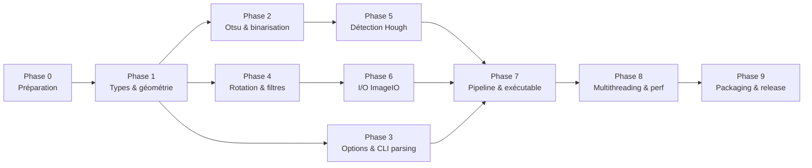

# 09 — Plan d'implémentation

> **Document historique** : ce plan a été exécuté intégralement (phases 0 à 9
> terminées, releases v0.1.0 → v0.3.0). Il est conservé comme référence de la
> démarche. L'état courant des tâches est dans [`TODO.md`](../TODO.md).

Découpage en phases avec dépendances, livrables et critères de sortie. Les phases 1–5
sont **purement algorithmiques** (aucune entrée-sortie) et donc testables isolément ;
c'est là que se joue la parité.

## Vue d'ensemble

---

## Phase 0 — Préparation (faite)

**Objectif** : disposer de l'oracle et du squelette.

Livrables :

- ✅ Oracle v1.33 compilé localement : `Scripts/compile_local.sh` → `Bin/deskew`
  (nécessite FPC ; support TIFF via `libtiff` Homebrew).
- ✅ Golden files générés : `Tests/DeskewParityTests/generate_reference.sh` →
  `Tests/DeskewParityTests/reference/` (37 cas : détection, rotations, filtres,
  couleurs, formats, marges/rectangles, TIFF, work-image). Voir le README du dossier.
- ✅ Squelette SwiftPM (`DeskewCore`, `DeskewImageIO`, `DeskewCLI`, tests) compilant.
- ✅ `LICENSE` (MPL 2.0) à la racine.
- ✅ Job CI (build + tests release) sur macOS ARM.

Critère de sortie : `swift build && swift test` passe, golden files exploitables par
un test de comparaison.

---

## Phase 1 — Types et géométrie

**Objectif** : briques de base.

Livrables :

- `GrayImage`, `RGBImage`, `RGBAImage`, `PixelFormat`, `RGB24`, `RGBA32`.
- `IntRect`, `FloatRect`, `SizeUnit`, `IntPoint`.
- `ResolutionInfo` (DPI ↔ taille de pixel en µm, conversion d'unités).
- `ContentRect.calcRectInPixels` + `ContentRect.forImage` (marges vs rectangle).

Tests : `TestCalcDetectionRect` porté intégralement (avec les DPI), `RectToStr`,
`IsRectNull`/`IsFloatRectNull`.

Critère de sortie : tous les vecteurs de géométrie/unités passent.

Dépendances : aucune.

---

## Phase 2 — Otsu et binarisation

**Objectif** : seuillage exact.

Livrables : `Otsu.threshold`, `Binarization.binarize`, `ClampToByte`.

Tests : les 7 cas Otsu + 2 cas binarisation (voir [07](07-Parite-et-Tests.md) § 3.1–3.2).

Critère de sortie : **bit-exact** sur tous les cas. Aucune tolérance acceptée ici.

Dépendances : Phase 1.

---

## Phase 3 — Options et analyse CLI

**Objectif** : reproduire le contrat CLI indépendamment de l'exécutable.

Livrables : `DeskewOptions`, `parse`, `parseOption`, `parseFloatRect`,
`isValid`, `description` (≡ `OptionsToString`), `TiffCompression` et son mapping.

Tests : porter `TestCmdLineArgs.pas` en entier (parsing, défauts, couleurs,
compression, marges, formats, drapeaux) + tolérances françaises.

Critère de sortie : tous les tests d'options passent ; messages d'erreur identiques.

Dépendances : Phase 1.

---

## Phase 4 — Rotation et rééchantillonnage

**Objectif** : rotation exacte et filtres.

Livrables, dans l'ordre :

1. `rotate90` (90/180/270) et `ImageRotation.rotate` (dimensions, boîte englobante).
2. Filtre `nearest`.
3. Filtre `linear` (`bilinearGray/RGB/RGBA`, coordonnées, fond).
4. Filtres `cubic`/`lanczos` (table de poids, `applyKernel`, gestion des bords).

Tests :

- dimensions pour les angles 90/180/270/-1/1/20/45/75/111/193/217/333 (nearest +
  cubic) ;
- mapping des quadrants (90/180, Gray8 et RGB24) ;
- couleur de fond dans les coins (linear, Gray8) ;
- rotation 0° identité.

Critère de sortie :

- multiples de 90 et nearest : **bit-exact** ;
- linear/cubic/lanczos : écart `≤ 2` sur les bords, `0` en zone unie.

Dépendances : Phase 1.

---

## Phase 5 — Détection d'inclinaison (Hough)

**Objectif** : reproduire l'angle détecté.

Livrables : `HoughSkewDetector.rotationAngle`, statistiques, pré-calcul `Sin/Cos`,
garde-fou d'indice.

Tests :

- golden : pour chaque image de `TestImages/` et jeu d'options, comparer l'angle au
  binaire Pascal (tolérance `± 0.05°`) et les statistiques de détection appliquées à
  `work-image.png` (seuil, pixels testés, taille d'accumulateur) ;
- cohérence : angle détecté + rotation → lignes horizontales.

Critère de sortie : angle `± AngleStep` sur tout le corpus ; statistiques cohérentes.

Dépendances : Phase 2 (seuil) et 3 (options `-a`, `-d`, `-t`).

---

## Phase 6 — Entrées-sorties ImageIO

**Objectif** : charger/sauvegarder de vraies images.

Livrables :

- `ImageLoader` (ImageIO) → `PixelImage` + `ResolutionInfo` ; conversion Gray8.
- `ImageWriter` (ImageIO) avec formats PNG/JPEG/TIFF/GIF/BMP, qualité JPEG,
  compression TIFF, DPI.
- `PixelConversion` (`ensureRotatable`, conversions de formats, palettes).

Tests : charger chaque image de `TestImages/`, vérifier dimensions/format/DPI ;
réécrire et relire (round-trip) ; comparer les TIFF au binaire Pascal.

Critère de sortie : les formats de `runtests.sh` sont lus/écrits ; DPI préservés.

Dépendances : Phase 1.

---

## Phase 7 — Pipeline et exécutable

**Objectif** : l'outil complet, cliquet de la parité.

Livrables :

- `Pipeline.run` (≡ `DoDeskew`) : copie couleur, image de travail grise, DPI override,
  zone de détection, seuil, détection, work-image, detect-only, rotation, format forcé.
- `DeskewCLI` : `DeskewCommand` (parsing via `DeskewOptions`), bannière, journal,
  messages, codes de sortie, copie de fichier si inchangé.
- `Bin/runtests.sh` équivalent (`Tests/DeskewParityTests`).

Tests : toutes les commandes de `runtests.sh`, comparaison images + console.

Critère de sortie : 100 % des cas d'intégration exécutés sans erreur, écarts pixels
conformes aux tolérances.

Dépendances : Phases 3, 5, 6.

---

## Phase 8 — Multithreading et performance

**Objectif** : tenir les objectifs arm64.

Livrables (voir [06](06-Multithreading-et-Performance.md)) :

- Hough : partition par plages d'angles, liste de pixels pré-générée, pré-calcul
  `Sin/Cos`.
- Rotation : `concurrentPerform` par bandes, table de poids partagée, SIMD en
  cubic/lanczos.
- Otsu : histogramme par bandes.
- Seuils de taille (ne pas paralléliser les petites images).

Tests : **re-exécuter l'intégralité des tests de parité** après chaque parallélisation
(les résultats doivent être identiques — la parallélisation ne doit rien changer au
résultat, sauf si les accumulateurs partiels changent l'ordre des angles, ce qui est
exclu par la partition par colonnes).

Critère de sortie : tests verts + gain mesuré par rapport à la version séquentielle et
au binaire Pascal (timings `-s t`).

Dépendances : Phases 4, 5, 7.

---

## Phase 9 — Packaging et release

**Objectif** : livrable utilisable.

Livrables :

- ✅ binaire `deskew` **universel** (arm64 + x86_64) via
  `Scripts/build_swift_release.sh` ;
- ✅ `swift build -c release` reproductible, CI GitHub Actions ;
- ✅ README d'installation/usage et parité de la sortie console ;
- ✅ notes sur les formats supportés (et exclusions) dans `Documentation/04`.

Critère de sortie : binaire publié ; tests verts en release.

---

## Risques et points de vigilance

| Risque | Phase | Mitigation |
| ------ | ----- | ---------- |
| Parité de `Round` / `Trunc` | 4, 5 | helpers dédiés + tests empiriques |
| Parité RGB24 (ordre des canaux) | 4, 6 | layout fixé, tests quadrants couleur |
| Gestion colorimétrique ImageIO | 6 | espace device, tests de round-trip |
| Palettes (ifIndex8) | 6 | conversion à l'import, tests |
| Débordement de l'accumulateur Hough | 5 | garde-fou d'indice |
| Formats non supportés (DDS/TGA/Netpbm) | 6 | décision produit explicite |
| Temps de compilation / perf des génériques | 4, 8 | surcharges plutôt que génériques |
| Multithreading non déterministe | 8 | partition sans recouvrement + tests répétés |

## Définition de « terminé » (v1)

1. L'exécutable reproduit les options, messages et codes de sortie de l'original.
2. Tous les cas de `runtests.sh` passent avec les tolérances de
   [07](07-Parite-et-Tests.md).
3. Otsu, binarisation, géométrie, rotation 90/180/270/nearest sont bit-exacts.
4. Le multithreading n'altère aucun résultat.
5. La documentation de ce dossier est à jour et suffit à un nouveau contributeur.
